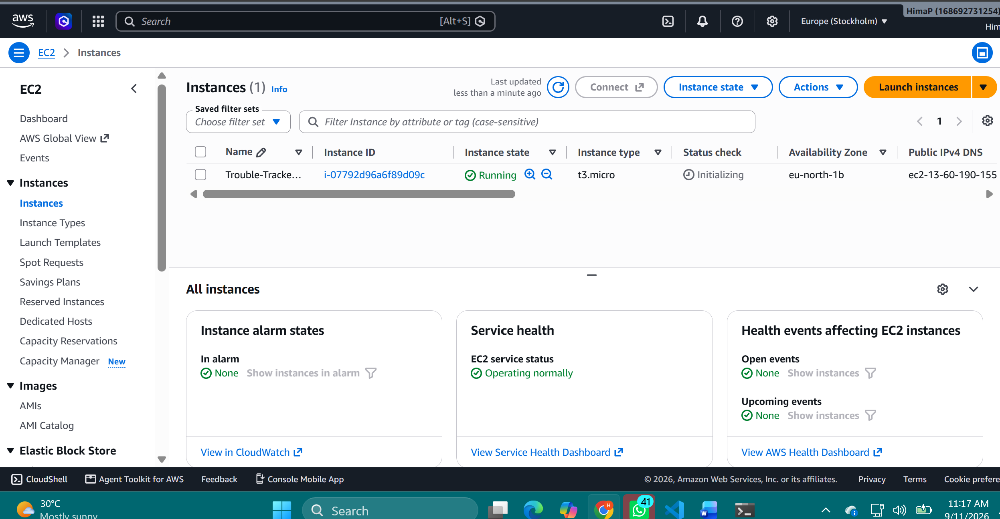
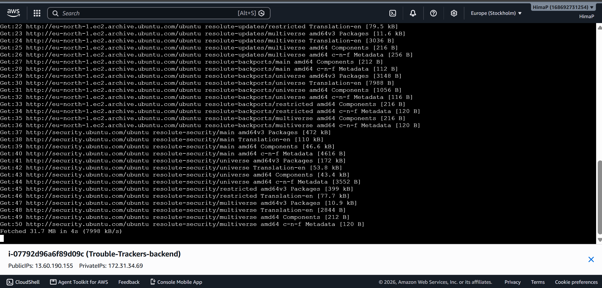
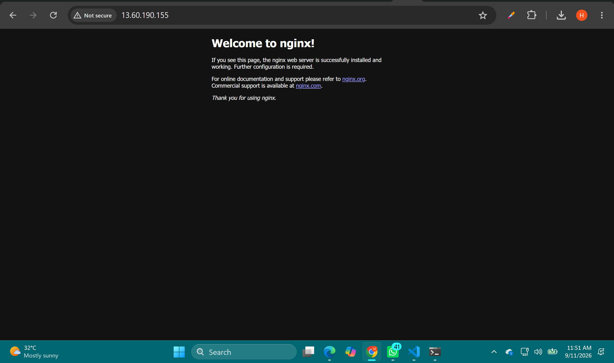
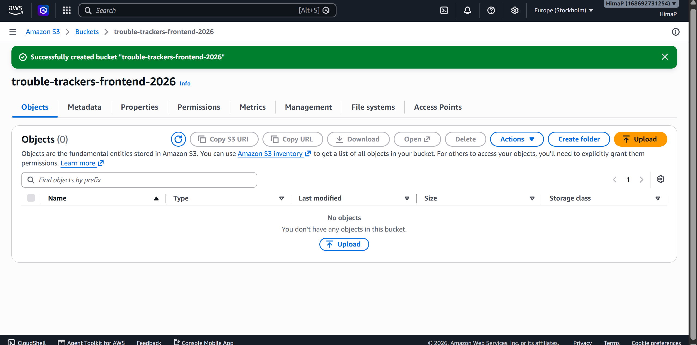
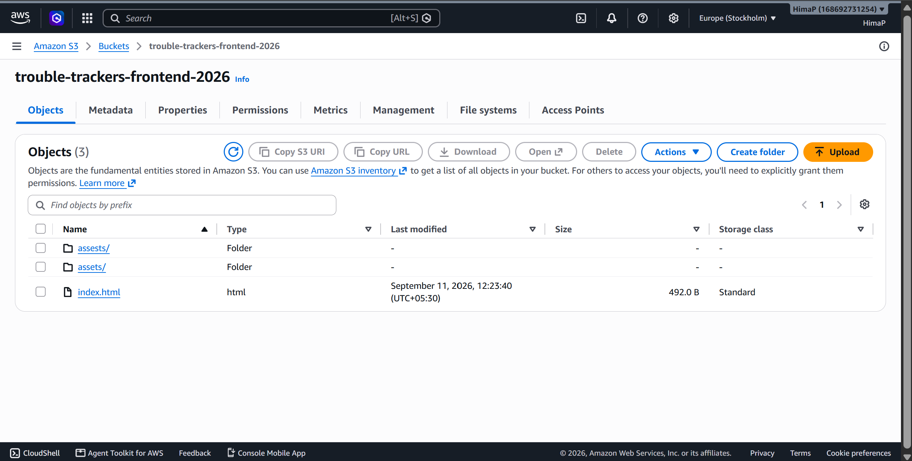
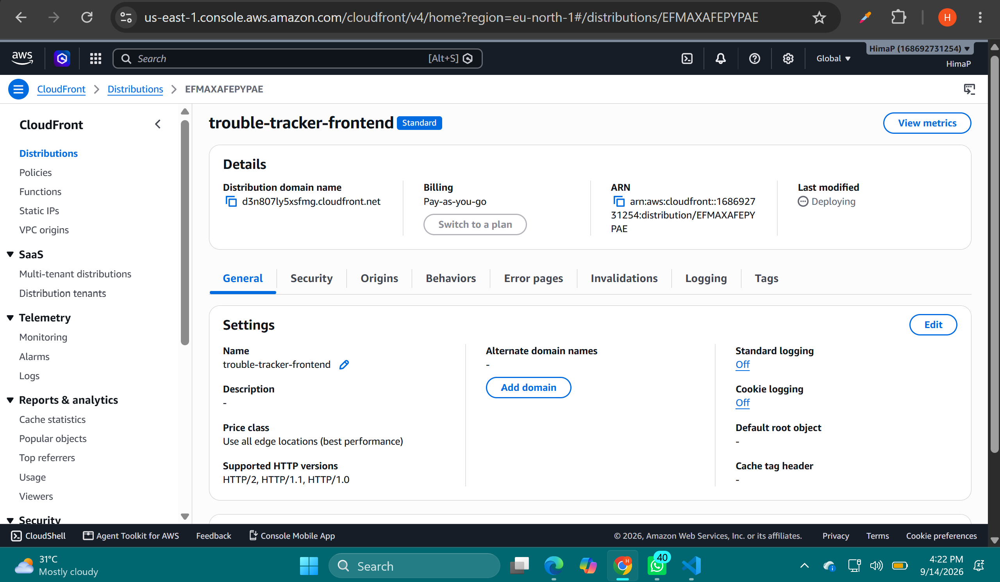
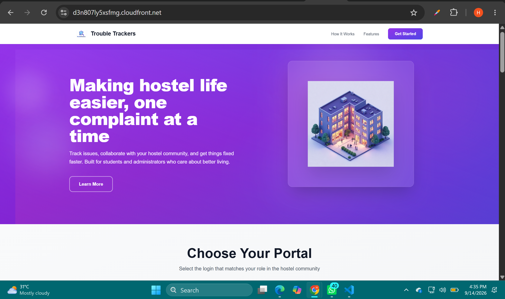
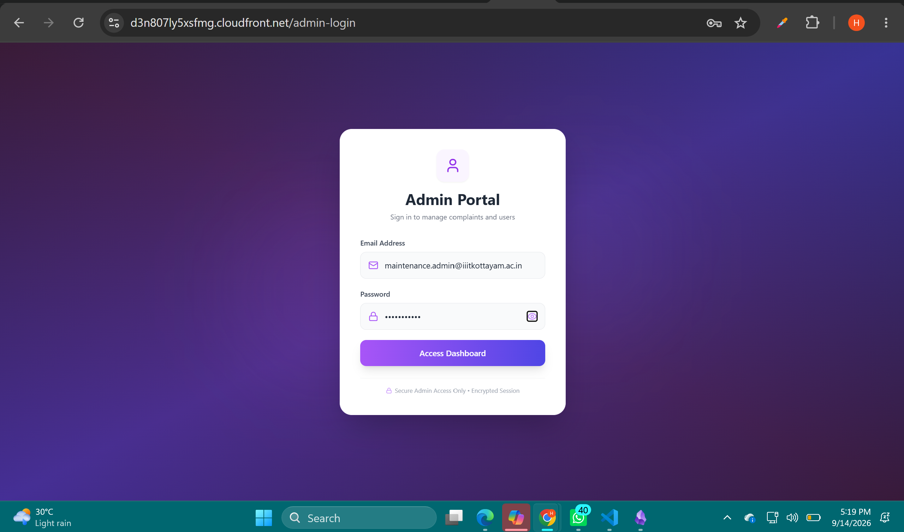
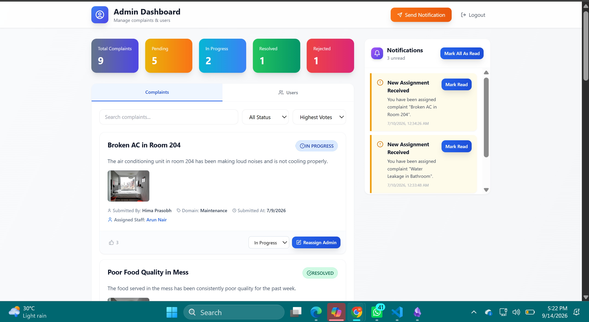
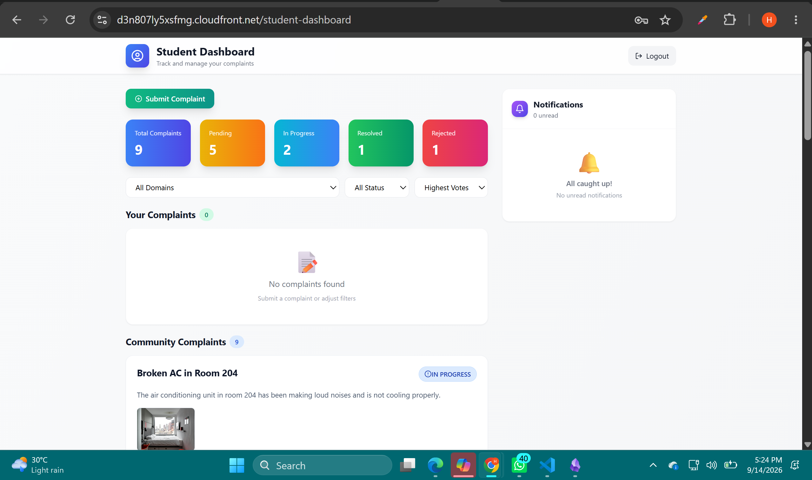

# AWS Deployment — Trouble Trackers

This document records the deployment of the **Trouble Trackers MERN application** on AWS, including the infrastructure setup, production configuration, deployment process, verification, and the issues encountered during deployment.

## 1. Deployment Architecture

The application was deployed using the following architecture:

```text
                         Internet
                            │
                            ▼
                  ┌───────────────────┐
                  │    CloudFront     │
                  │  HTTPS / CDN      │
                  └─────────┬─────────┘
                            │
                 ┌──────────┴──────────┐
                 │                     │
              Frontend               /api/*
                 │                     │
                 ▼                     ▼
        ┌────────────────┐     ┌────────────────┐
        │   Amazon S3    │     │   Amazon EC2   │
        │ React/Vite     │     │     Nginx      │
        │ production     │     │      ↓         │
        │ build          │     │    Express     │
        └────────────────┘     │      ↓         │
                               │ MongoDB Atlas   │
                               └────────────────┘
```

### AWS services used

- **Amazon EC2** — hosts the Node.js/Express backend.
- **Nginx** — reverse proxy in front of the Express server.
- **PM2** — keeps the backend process running.
- **Amazon S3** — stores the Vite production frontend.
- **Amazon CloudFront** — serves the frontend over HTTPS and routes `/api/*` requests to EC2.
- **MongoDB Atlas** — cloud database used by the backend.

---

# 2. EC2 Backend Deployment

## Step 1 — Launch the EC2 instance

An Ubuntu EC2 instance was launched in the **Europe (Stockholm) / `eu-north-1`** region.

The instance was configured as the backend server.



The instance was verified as running from the EC2 console.

---

## Step 2 — Connect to EC2

The instance was accessed using **EC2 Instance Connect**.

For an Ubuntu AMI, the correct SSH/Instance Connect username is:

```text
ubuntu
```

### Security Group configuration

Initially, EC2 Instance Connect could not connect because port `22` was restricted to the local client IP.

The issue was:

```text
Port 22 was only allowed from a specific IP address.
EC2 Instance Connect uses AWS-managed source addresses.
```

The Security Group was updated to allow SSH from the appropriate **EC2 Instance Connect managed prefix list**, while retaining the required local access rule.

This resolved the EC2 Instance Connect problem.

---

## Step 3 — Install Node.js and npm

Node.js and npm were installed on the Ubuntu EC2 instance.

The package installation produced the normal Ubuntu package-download output:



The installation was allowed to complete before continuing.H

---

## Step 4 — Clone the GitHub repository

The project repository was cloned into the EC2 instance:

```bash
git clone <repository-url>
cd Trouble-Trackers-Final
```

The repository contains separate frontend and backend directories:

```text
Trouble-Trackers-Final/
├── frontend/
└── backend/
```

---

## Step 5 — Install backend dependencies

The backend is located inside the `backend` directory, so the correct procedure is

```bash
cd ~/Trouble-Trackers-Final/backend
npm install
```

---

## Step 6 — Configure backend environment variables

The backend environment file was placed at:

```text
backend/.env
```

The backend uses environment variables for configuration, including:

```env
MONGO_URI=...
FRONTEND_URL=...
PORT=5000
JWT_SECRET=...
```

**The real `.env` file must not be committed to GitHub.**

The repository `.gitignore` should contain entries such as:

```gitignore
node_modules/
.env
.env.*
!.env.example
dist/
build/
```

The production `FRONTEND_URL` was updated to the CloudFront frontend URL once the CloudFront distribution was available.

---

# 3. Nginx Reverse Proxy

## Step 7 — Install Nginx

Nginx was installed on the EC2 instance:

```bash
sudo apt update
sudo apt install nginx -y
```

After installation, Nginx was verified as running.

An initial browser request showed the standard Nginx welcome page:



This confirmed that:

- EC2 was reachable over HTTP.
- Port `80` was accessible.
- Nginx was installed correctly.

However, the default Nginx site was still serving the request instead of forwarding it to Express.

---

## Step 8 — Configure Nginx as a reverse proxy

The default Nginx site configuration was replaced with a reverse-proxy configuration:

```nginx
server {
    listen 80 default_server;
    listen [::]:80 default_server;

    server_name _;

    location / {
        proxy_pass http://127.0.0.1:5000;

        proxy_http_version 1.1;

        proxy_set_header Host $host;
        proxy_set_header X-Real-IP $remote_addr;
        proxy_set_header X-Forwarded-For $proxy_add_x_forwarded_for;
        proxy_set_header X-Forwarded-Proto $scheme;
    }
}
```

The configuration was tested and Nginx was restarted:

```bash
sudo nginx -t
sudo systemctl restart nginx
```

### Configuration error encountered

An attempt to overwrite the Nginx configuration without elevated privileges resulted in:

```text
Permission denied
```

The issue was caused by writing directly to `/etc/nginx/...` without using `sudo` for the shell redirection.

The configuration was subsequently written with appropriate privileges.

---

# 4. Verify the Backend Through Nginx

## Step 9 — Verify Express

The Express application was running on:

```text
127.0.0.1:5000
```

A direct request:

```bash
curl http://localhost:5000
```

returned:

```text
Cannot GET /
```

This was **not a failure**. It indicated that Express was running but did not define a `GET /` route.

The important API routes were under:

```text
/api/auth
/api/complaints
/api/notifications
/api/users
/api/images
```

---

## Step 10 — Verify the API through Nginx

Before the reverse-proxy configuration was corrected, a request such as:

```bash
curl -i -X POST http://localhost/api/auth/login \
-H "Content-Type: application/json" \
-d '{}'
```

returned:

```text
404 Not Found
Server: nginx
```

This showed that Nginx was still using the default configuration.

After configuring the reverse proxy, the same request reached Express and returned:

```text
HTTP/1.1 500 Internal Server Error
X-Powered-By: Express

{"message":"Server error"}
```

For the deliberately empty `{}` test body, this confirmed that:

```text
Client
  ↓
Nginx :80
  ↓
Express :5000
```

was functioning.

The `500` response was therefore useful as a connectivity test; it was not evidence that the reverse proxy was broken.

---

# 5. PM2 Backend Process Management

## Step 11 — Run Express with PM2

PM2 was installed and the backend was started as:

```text
trouble-trackers-api
```

The backend process was verified with:

```bash
pm2 status
```

The process was shown as:

```text
trouble-trackers-api    online
```

PM2 was also configured to restore the process after an EC2 restart:

```bash
pm2 startup
pm2 save
```

This allows the backend service to continue running without manually starting Node.js after every reboot.

---

# 6. Amazon S3 Frontend Deployment

## Step 12 — Create the S3 bucket

An S3 bucket was created for the frontend production build:

```text
trouble-trackers-frontend-2026
```

The bucket was created in:

```text
Europe (Stockholm) — eu-north-1
```



The S3 bucket is used for the **static React/Vite frontend**.

It is separate from any application data or user-uploaded image storage.

---

## Step 13 — Build the React/Vite frontend

The Vite production build was generated using:

```bash
npm run build
```

This creates:

```text
frontend/dist/
├── index.html
└── assets/
```

The `dist` directory contains the optimized production files that are deployed to S3.

The production API configuration was set through:

```env
VITE_API_URL=http://13.60.190.155
```

during the initial deployment process.

The frontend Axios configuration uses the Vite environment variable instead of hard-coded localhost API URLs.

---

## Step 14 — Upload the production build to S3

The **contents of `dist`**, rather than the entire source project, were uploaded to S3.

The bucket contained:

```text
assets/
assests/
index.html
```



The production frontend is therefore stored as static objects in S3.

---

# 7. CloudFront Configuration

## Step 15 — Create the CloudFront distribution

CloudFront was configured to distribute the S3-hosted frontend.

The CloudFront distribution was created with:

```text
Distribution:
trouble-tracker-frontend
```



CloudFront provides the public HTTPS endpoint for the application.

---

## Step 16 — Keep S3 private

S3 **Block Public Access** was kept enabled.

Instead of making the S3 bucket publicly readable, CloudFront was granted access through an **Origin Access Control (OAC)**.

The bucket policy allows the CloudFront service principal to retrieve objects.

This provides the intended flow:

```text
User
  ↓ HTTPS
CloudFront
  ↓ OAC
Private S3 bucket
```

rather than:

```text
User
  ↓
Public S3 bucket
```

---

## Step 17 — Configure the `/api/*` CloudFront behavior

A separate CloudFront behavior was configured for:

```text
/api/*
```

This behavior routes API requests to the EC2 backend origin.

The behavior was configured to:

- Allow `GET`
- Allow `HEAD`
- Allow `POST`
- Allow `PUT`
- Allow `PATCH`
- Allow `DELETE`
- Allow `OPTIONS`
- Disable caching for API requests
- Redirect HTTP viewers to HTTPS

The API behavior therefore separates frontend delivery from backend API traffic:

```text
/*      → S3
/api/*  → EC2
```

---

# 8. CloudFront → EC2 Origin Configuration

## Step 18 — Configure the EC2 origin

The backend was added to CloudFront as a custom HTTP origin.

The EC2 public DNS name was used:

```text
ec2-13-60-188-9.eu-north-1.compute.amazonaws.com
```

The origin communicates with Nginx over:

```text
HTTP
Port 80
```

Nginx then forwards the request internally to:

```text
127.0.0.1:5000
```

---

# 9. Major Deployment Issues and Fixes

Several issues were encountered during deployment. They are documented here because they were part of the actual deployment/debugging process.

## Issue 1 — EC2 Instance Connect could not connect

### Symptom

EC2 Instance Connect failed to establish an SSH connection.

### Cause

The Security Group allowed port `22` only from a single client IP. EC2 Instance Connect connects using AWS-managed source ranges.

### Fix

The EC2 Security Group was updated to allow the appropriate EC2 Instance Connect managed prefix list on port `22`.

---

## Issue 2 — Wrong EC2 username

The EC2 instance was based on Ubuntu.

The correct username was:

```text
ubuntu
```

rather than:

```text
ec2-user
```

---

## Issue 3 — Nginx returned 404 for `/api/auth/login`

### Symptom

```text
POST /api/auth/login
→ 404 Not Found
→ Server: nginx
```

### Cause

Nginx was still using its default website configuration:

```nginx
try_files $uri $uri/ =404;
```

### Fix

Nginx was changed to reverse-proxy requests to:

```text
127.0.0.1:5000
```

After the change, the same request reached Express.

---

## Issue 4 — `sudo cat > ...` returned Permission Denied

### Symptom

Attempting to write the Nginx configuration produced:

```text
-bash: /etc/nginx/sites-available/default: Permission denied
```

### Cause

`sudo` was applied to `cat`, but the shell's `>` redirection was still performed without root privileges.

### Fix

The configuration was written using a privileged method and then validated with:

```bash
sudo nginx -t
```

---

## Issue 5 — CloudFront account verification requirement

When creating CloudFront resources, AWS initially displayed an account-verification requirement.

The CloudFront resource creation was temporarily blocked until the AWS account verification request was resolved.

The deployment was continued after the verification issue was resolved.

---

## Issue 6— S3 `AccessDenied`

Opening the S3 object directly initially produced:

```text
AccessDenied
```

### Cause

S3 Block Public Access was enabled.

This was intentional because the bucket was designed to remain private behind CloudFront.

### Fix

CloudFront was configured with Origin Access Control and the S3 bucket policy was configured to allow CloudFront to retrieve the objects.

Therefore, direct public S3 access remaining blocked is expected.

---

## Issue 7 — Mixed Content error

### Symptom

The browser reported:

```text
Mixed Content:
The page was loaded over HTTPS, but requested an insecure XMLHttpRequest endpoint
http://13.60.190.155/api/auth/login
```

### Cause

The frontend was being served through:

```text
https://<cloudfront-domain>
```

but the API URL was still:

```text
http://13.60.190.155
```

Browsers block insecure HTTP requests originating from an HTTPS page.

### Resolution during deployment

The CloudFront API behavior was configured so that:

```text
https://<cloudfront-domain>/api/*
```

is routed to the EC2 backend origin.

The frontend was rebuilt so that API requests use the CloudFront API path instead of directly calling the insecure EC2 HTTP URL.

This resulted in the browser sending:

```text
POST https://<cloudfront-domain>/api/auth/login
```

while CloudFront internally forwards the request to EC2 over HTTP.

---

## Issue 8 — CloudFront returned `502 Bad Gateway`

### Symptom

The browser showed:

```text
POST https://<cloudfront-domain>/api/auth/login
502 Bad Gateway
```

### Cause

The CloudFront EC2 origin had initially been configured with the EC2 **private/internal DNS name**:

```text
ip-172-31-46-3.eu-north-1.compute.internal
```

CloudFront could not reach that private EC2 address.

### Fix

The CloudFront origin was changed to the EC2 public DNS name:

```text
ec2-13-60-188-9.eu-north-1.compute.amazonaws.com
```

with:

```text
Protocol: HTTP
Port: 80
```

After the origin was corrected, CloudFront successfully connected through Nginx to Express.

---

# 10. Production Verification

After the configuration changes, the complete application was tested through the CloudFront HTTPS endpoint.

## Landing page

The application was successfully loaded through the CloudFront domain:



This verifies that:

```text
CloudFront → S3 → React/Vite
```

is functioning.

---

## Admin Login

The production Admin Login page was successfully loaded:



The login request successfully passed through:

```text
Browser
   ↓ HTTPS
CloudFront /api/*
   ↓
EC2 public origin
   ↓
Nginx
   ↓
Express
   ↓
MongoDB Atlas
```

---

## Admin Dashboard

Admin authentication and dashboard loading were successfully verified.

The dashboard displays:

- Total complaints
- Pending complaints
- In-progress complaints
- Resolved complaints
- Rejected complaints
- Notifications
- Complaint management
- User management



---

## Student Dashboard

The student portal was also successfully verified through CloudFront.

The dashboard provides:

- Complaint submission
- Complaint filtering
- Complaint status
- Community complaints
- Notifications
- Student-specific complaint information



---

# 11. Final Deployment Result

The deployed system successfully provides:

```text
Frontend:
React + Vite
        ↓
Amazon S3
        ↓
Amazon CloudFront + HTTPS

Backend:
Node.js + Express
        ↓
PM2
        ↓
Nginx
        ↓
EC2

Database:
MongoDB Atlas
```

The final public application is available through the CloudFront distribution domain.


**The S3 bucket was intentionally kept private and accessed through CloudFront rather than exposing the bucket directly to the public internet.**
